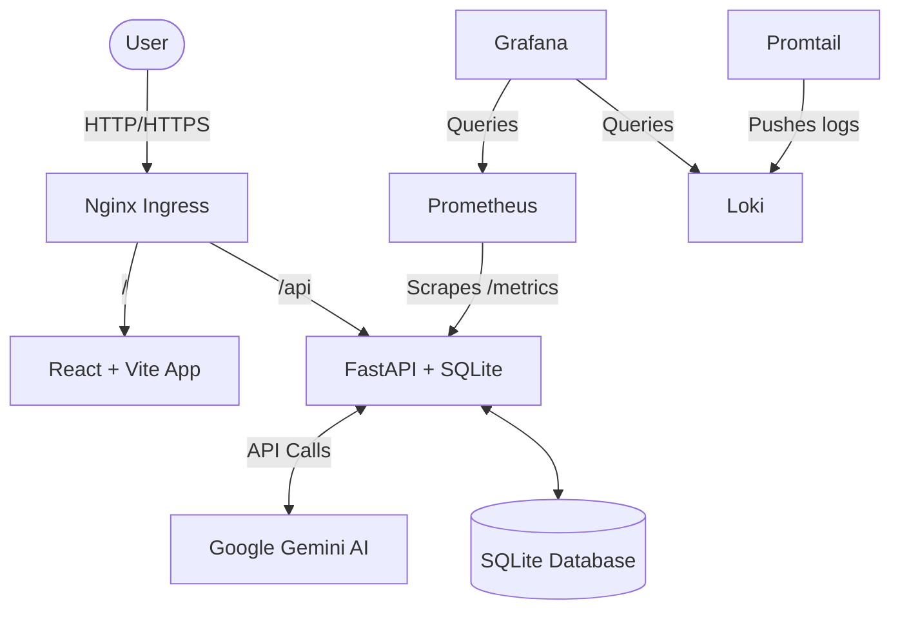

# KubeWatch AI

KubeWatch AI is a production-ready CI/CD enabled Kubernetes Monitoring and AI Log Intelligence Platform.

## 🚀 Features
- **AI Log Analyzer**: Paste Kubernetes error logs and get Gemini AI-powered explanations, root causes, and suggested fixes.
- **Real-time Dashboard**: Overview of pods, deployments, API health, and recent incidents.
- **Monitoring Stack**: Integrated Prometheus for metrics and Grafana for beautiful visualizations.
- **Log Aggregation**: Loki + Promtail for comprehensive cluster logging.
- **Full CI/CD Pipeline**: GitHub actions for testing, building, pushing, and deploying to Kubernetes.
- **Secure Authentication**: JWT-based login for admin operations.

## 🏗️ Architecture



## 🛠️ Tech Stack
- **Frontend**: React, Vite, TailwindCSS v4, Recharts, Lucide Icons
- **Backend**: FastAPI, SQLAlchemy, Pydantic, Passlib, Google GenAI SDK
- **Database**: SQLite (easy local setup)
- **Containerization**: Docker, Docker Compose
- **Orchestration**: Kubernetes (Minikube / Kind compatible)
- **CI/CD**: GitHub Actions
- **Monitoring & Logging**: Prometheus, Grafana, Loki, Promtail

## 📁 Folder Structure
- `backend/`: FastAPI application code and requirements.
- `frontend/`: React application using Vite and Tailwind.
- `k8s/`: Kubernetes deployment manifests.
- `.github/workflows/`: CI/CD action pipelines.

## ⚙️ Local Setup Commands

### Prerequisites
- Node.js & npm
- Python 3.11+
- Docker & Docker Compose
- (Optional) Minikube or Kind for K8s testing

### 1. Environment Setup
Create a `.env` file in the `backend/` directory:
```
GEMINI_API_KEY=your_google_gemini_api_key
```

### 2. Run with Docker Compose
To run the full stack locally without Kubernetes:
```bash
docker-compose up --build
```
- Frontend: http://localhost:80
- Backend API: http://localhost:8000/docs
- Prometheus: http://localhost:9090
- Grafana: http://localhost:3000

### 3. Run Manually (Development)
**Backend**:
```bash
cd backend
python -m venv venv
# Activate venv
pip install -r requirements.txt
uvicorn app.main:app --reload
```

**Frontend**:
```bash
cd frontend
npm install
npm run dev
```

## ☸️ Kubernetes Setup Commands
Make sure you have a local cluster running (e.g., `minikube start`).

```bash
# 1. Create namespace
kubectl apply -f k8s/namespace.yaml

# 2. Add your secret (edit secret.yaml first with your base64 encoded API key)
kubectl apply -f k8s/secret.yaml

# 3. Apply all manifests
kubectl apply -f k8s/
```

## 🔄 CI/CD Setup Guide
1. Push this repository to GitHub.
2. In your GitHub repository settings, add the following secrets:
   - `DOCKER_USERNAME`: Your Docker Hub username.
   - `DOCKER_PASSWORD`: Your Docker Hub password/token.
   - `KUBECONFIG`: Your base64 encoded kubeconfig file for the deployment target.
3. Every push to the `main` branch will trigger tests, build Docker images, push to Docker Hub, and apply the manifests to your cluster.

## 📝 Resume Bullets
- Architected and deployed a scalable Kubernetes monitoring platform utilizing FastAPI, React, and Google Gemini AI, decreasing mean-time-to-resolution (MTTR) for cluster incidents through automated log analysis.
- Engineered a robust CI/CD pipeline using GitHub Actions to automatically test, build, and deploy Dockerized microservices to a Kubernetes cluster with zero downtime.
- Integrated a comprehensive observability stack (Prometheus, Grafana, Loki) for real-time tracking of API latencies, pod health, and error rates.
