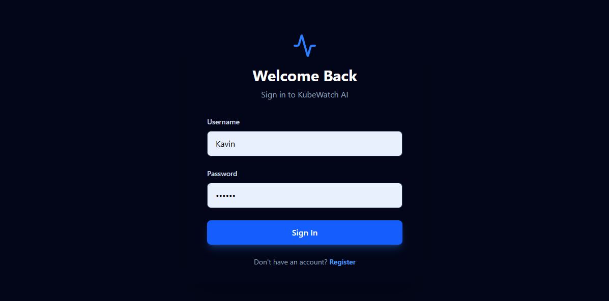
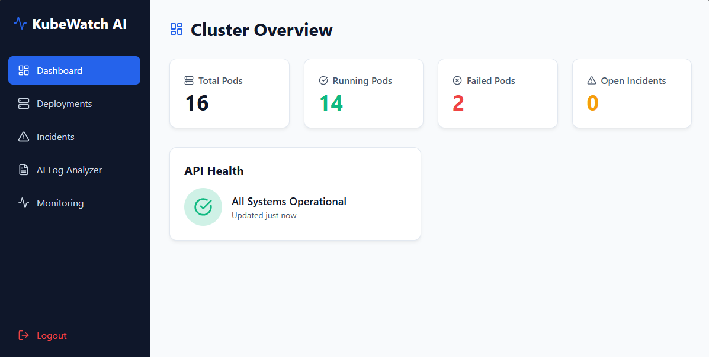
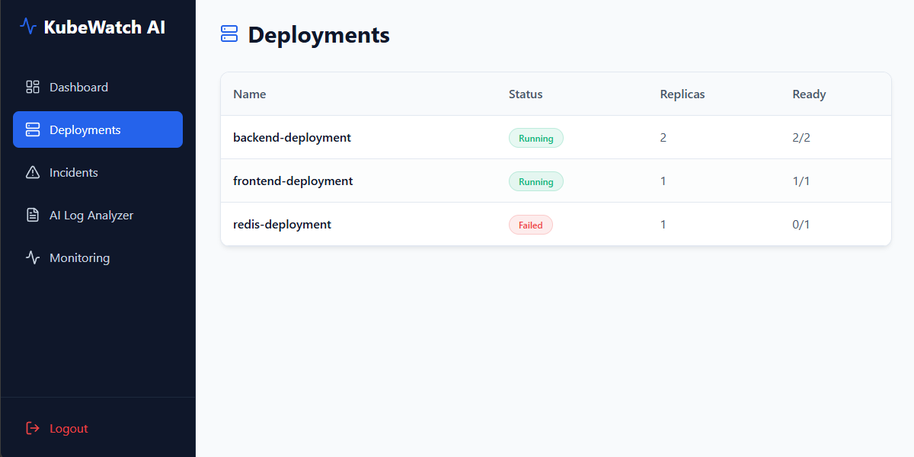
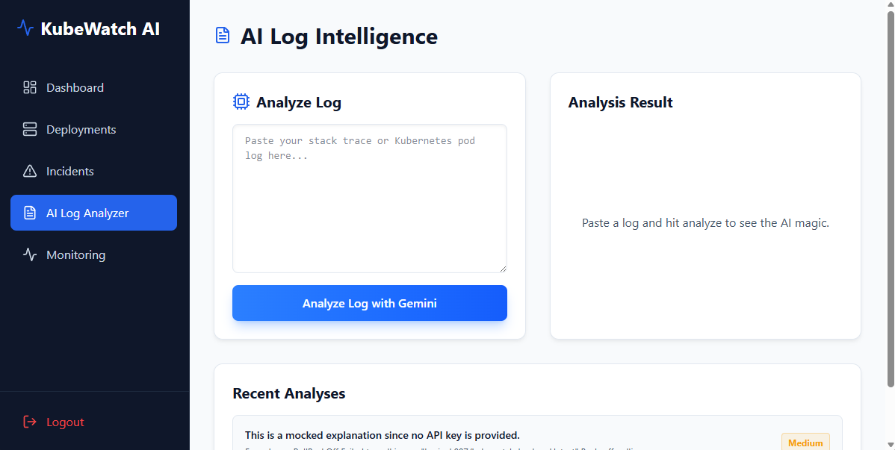
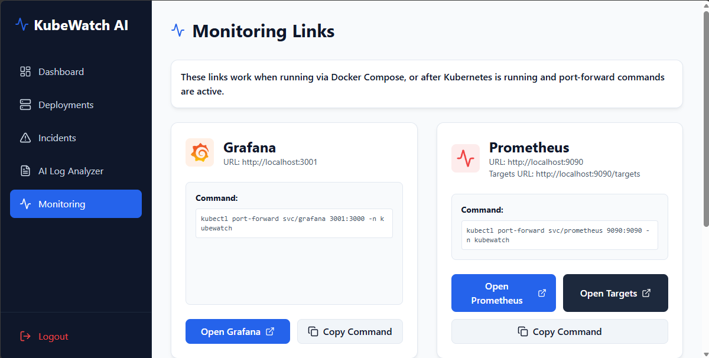
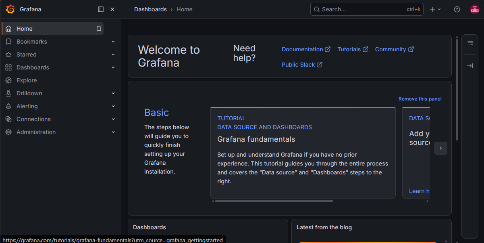
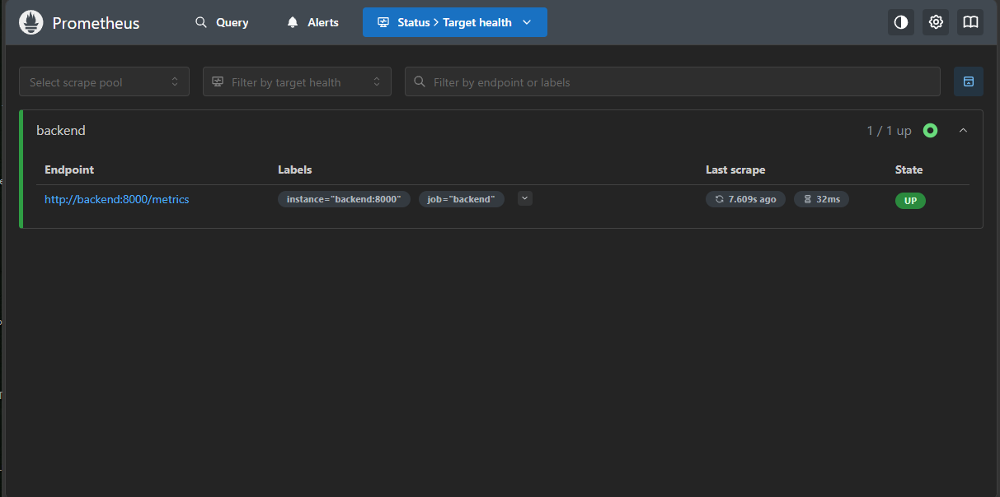
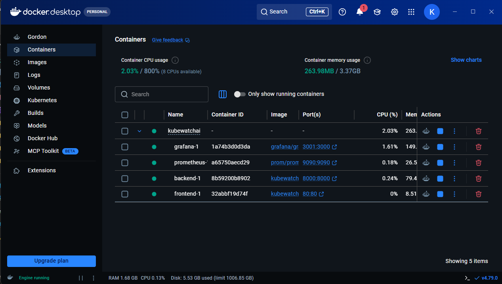
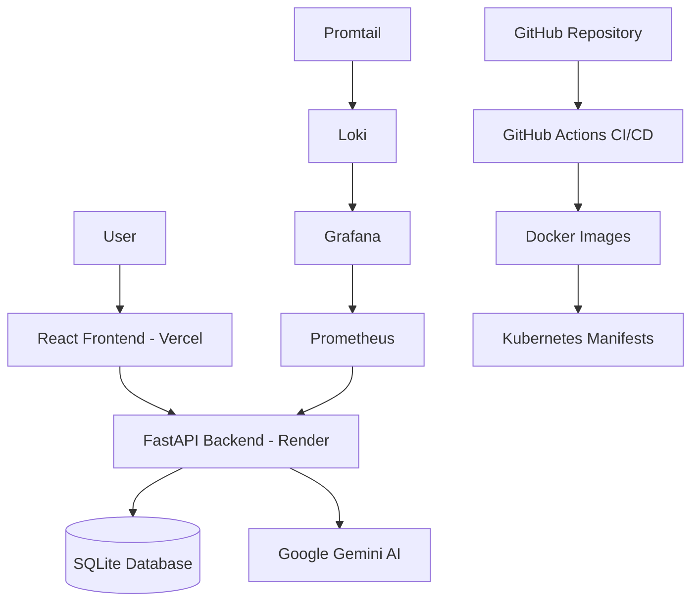

# KubeWatch AI

KubeWatch AI is a DevOps monitoring and AI log intelligence platform built with React, FastAPI, Docker, Prometheus, Grafana, Kubernetes manifests, GitHub Actions, and Gemini AI.

The platform helps users monitor deployments, track incidents, analyze Kubernetes logs, and understand deployment failures using AI-generated root-cause analysis.

## Live Demo

Frontend Live Demo: https://kubewatch-ai-5rxo.vercel.app

Backend API Docs: https://kubewatch-ai-1.onrender.com/docs

GitHub Repository: https://github.com/Kavinvk007/kubewatch-ai

Note: Grafana and Prometheus are configured for local Docker Compose monitoring. They are intended for admin/developer observability, not regular application users.

## Features

* AI-powered Kubernetes log analysis using Gemini AI
* JWT-based authentication for secure access
* Cluster overview dashboard with pod, deployment, and incident status
* Deployment status tracking
* Incident creation and management
* AI-generated root cause, severity, suggested fix, and prevention tip
* Prometheus metrics integration
* Grafana dashboard provisioning
* Docker Compose setup for local full-stack monitoring
* Kubernetes manifests for deployment readiness
* GitHub Actions CI/CD workflow structure
* Frontend deployed on Vercel
* Backend deployed on Render

## Screenshots

### Login / Register Page



### Cluster Overview Dashboard



### Deployments Page



### AI Log Analyzer



### Monitoring Links



### Grafana Dashboard



### Prometheus Targets



### Docker Compose Running Containers



## Architecture



## Tech Stack

### Frontend

* React
* Vite
* Tailwind CSS
* Axios
* Recharts
* Lucide Icons

### Backend

* FastAPI
* SQLAlchemy
* Pydantic
* JWT Authentication
* Passlib
* Google Gemini API
* SQLite

### DevOps and Monitoring

* Docker
* Docker Compose
* Kubernetes
* GitHub Actions
* Prometheus
* Grafana
* Loki
* Promtail
* Nginx Ingress

### Deployment

* Vercel for frontend
* Render for backend

## Folder Structure

```text
kubewatch-ai/
├── backend/
│   ├── app/
│   │   ├── main.py
│   │   ├── database.py
│   │   ├── models.py
│   │   ├── schemas.py
│   │   ├── auth.py
│   │   ├── ai_service.py
│   │   ├── metrics.py
│   │   └── routes/
│   ├── requirements.txt
│   └── runtime.txt
│
├── frontend/
│   ├── src/
│   │   ├── components/
│   │   ├── pages/
│   │   ├── services/
│   │   ├── App.jsx
│   │   └── main.jsx
│   └── package.json
│
├── grafana/
│   ├── provisioning/
│   └── dashboards/
│
├── prometheus/
│   └── prometheus.yml
│
├── k8s/
│   ├── namespace.yaml
│   ├── backend-deployment.yaml
│   ├── backend-service.yaml
│   ├── frontend-deployment.yaml
│   ├── frontend-service.yaml
│   ├── ingress.yaml
│   ├── prometheus.yaml
│   ├── grafana.yaml
│   ├── loki.yaml
│   └── promtail.yaml
│
├── scripts/
├── screenshots/
├── docker-compose.yml
└── README.md
```

## Local Setup

### Prerequisites

Install the following tools:

* Node.js
* Python 3.11 or later
* Docker Desktop
* Docker Compose
* Git

### Backend Environment Setup

Create a `.env` file inside the `backend/` folder:

```env
GEMINI_API_KEY=your_google_gemini_api_key
```

### Run the Full Stack with Docker Compose

```bash
docker compose up --build -d
docker compose ps
```

Local URLs:

```text
Frontend: http://localhost
Backend API Docs: http://localhost:8000/docs
Prometheus: http://localhost:9090
Grafana: http://localhost:3001
```

Grafana local login:

```text
Username: admin
Password: admin
```

If the Grafana dashboard does not appear, restart Docker Compose:

```bash
docker compose down
docker compose up --build -d
```

### Run Backend Manually

```bash
cd backend
python -m venv venv
venv\Scripts\activate
pip install -r requirements.txt
uvicorn app.main:app --reload
```

Backend will run at:

```text
http://localhost:8000
```

### Run Frontend Manually

```bash
cd frontend
npm install
npm run dev
```

Frontend will run at:

```text
http://localhost:5173
```

## API Endpoints

```text
GET  /
GET  /health
GET  /api/health
POST /api/auth/register
POST /api/auth/login
GET  /api/dashboard
GET  /api/deployments
GET  /api/incidents
POST /api/incidents
POST /api/ai/analyze
GET  /metrics
```

Swagger API documentation:

```text
https://kubewatch-ai-1.onrender.com/docs
```

## Deployment

## Backend Deployment on Render

Create a new Render Web Service and use these settings:

```text
Environment: Python 3
Branch: main
Root Directory: leave empty
Build Command: cd backend && python -m pip install --upgrade pip setuptools wheel && pip install -r requirements.txt
Start Command: cd backend && uvicorn app.main:app --host 0.0.0.0 --port $PORT
```

Required environment variables:

```text
GEMINI_API_KEY=your_google_gemini_api_key
FRONTEND_URL=https://your-vercel-frontend-url.vercel.app
PYTHON_VERSION=3.11.9
```

Current backend API:

```text
https://kubewatch-ai-1.onrender.com/docs
```

## Frontend Deployment on Vercel

Import the GitHub repository into Vercel and use these settings:

```text
Framework Preset: Vite
Root Directory: frontend
Install Command: npm install
Build Command: npm run build
Output Directory: dist
```

Required environment variable:

```text
VITE_API_URL=https://kubewatch-ai-1.onrender.com/api
```

Current frontend live demo:

```text
https://kubewatch-ai-5rxo.vercel.app
```

## Local Monitoring

Prometheus and Grafana are available locally through Docker Compose.

Start services:

```bash
docker compose up --build -d
docker compose ps
```

Open:

```text
Grafana: http://localhost:3001
Prometheus: http://localhost:9090
Prometheus Targets: http://localhost:9090/targets
```

Grafana and Prometheus are intended for admin/developer monitoring. Normal users interact with the KubeWatch AI web dashboard.

## Kubernetes Setup on Windows

### Install kubectl and Minikube

```powershell
winget install -e --id Kubernetes.kubectl
winget install -e --id Kubernetes.minikube
```

Close PowerShell and open a new PowerShell window.

### Verify Installation

```powershell
kubectl version --client
minikube version
docker --version
```

### Start Docker Desktop

Open Docker Desktop and wait until the Docker Engine is running.

### Run Kubernetes Setup Scripts

```powershell
.\scripts\setup-kubernetes-windows.ps1
.\scripts\run-kubernetes-monitoring.ps1
```

### Start Port Forwarding

Open two separate PowerShell terminals:

```powershell
.\scripts\port-forward-grafana.ps1
```

```powershell
.\scripts\port-forward-prometheus.ps1
```

Open:

```text
Grafana: http://localhost:3001
Prometheus: http://localhost:9090
Prometheus Targets: http://localhost:9090/targets
```

## CI/CD

The repository includes a GitHub Actions workflow for testing, building Docker images, pushing images, and applying Kubernetes manifests.

Required GitHub repository secrets:

```text
DOCKER_USERNAME
DOCKER_PASSWORD
KUBECONFIG
```

CI/CD workflow includes:

* Dependency installation
* Backend tests
* Docker image build
* Docker image push
* Kubernetes manifest deployment
* Rollout verification

## Environment Variables

### Backend

```text
GEMINI_API_KEY=your_google_gemini_api_key
FRONTEND_URL=https://your-vercel-frontend-url.vercel.app
FRONTEND_URLS=https://preview-url-1.vercel.app,https://preview-url-2.vercel.app
PYTHON_VERSION=3.11.9
```

### Frontend

```text
VITE_API_URL=https://your-render-backend-url.onrender.com/api
```

## Troubleshooting

### Backend server not reachable

Open the backend API docs:

```text
https://kubewatch-ai-1.onrender.com/docs
```

Render free services may sleep after inactivity. Wait for the service to wake up, then refresh the frontend.

### CORS error

Check the Render environment variable:

```text
FRONTEND_URL=https://kubewatch-ai-5rxo.vercel.app
```

Do not add a trailing slash.

### Vercel build error

Use these Vercel settings:

```text
Root Directory: frontend
Install Command: npm install
Build Command: npm run build
Output Directory: dist
```

Do not use `cd frontend` in Vercel build commands when the Root Directory is already set to `frontend`.

### Grafana or Prometheus not opening

Confirm Docker containers are running:

```bash
docker compose ps
```

Open:

```text
Grafana: http://localhost:3001
Prometheus: http://localhost:9090
```

### Docker image pull timeout

Retry Docker Compose:

```bash
docker compose down
docker compose up --build -d
```

If Prometheus or Grafana image pull fails, pull images manually:

```bash
docker pull prom/prometheus:v2.55.1
docker pull grafana/grafana:11.3.0
```

## Resume Bullets

* Built KubeWatch AI, a DevOps monitoring and AI log intelligence platform using React, FastAPI, Docker Compose, Prometheus, Grafana, Kubernetes manifests, GitHub Actions, and Gemini AI.
* Developed an AI-powered Kubernetes log analyzer that explains deployment errors, identifies root causes, assigns severity levels, and suggests fixes.
* Integrated Prometheus and Grafana for local observability, enabling monitoring of backend metrics, service health, and platform performance.
* Deployed the frontend on Vercel and the backend on Render with production environment variables, CORS configuration, and API routing.
* Created Kubernetes manifests and CI/CD workflow structure to demonstrate containerized deployment readiness.

## License

This project is intended for educational, portfolio, and demonstration purposes.
